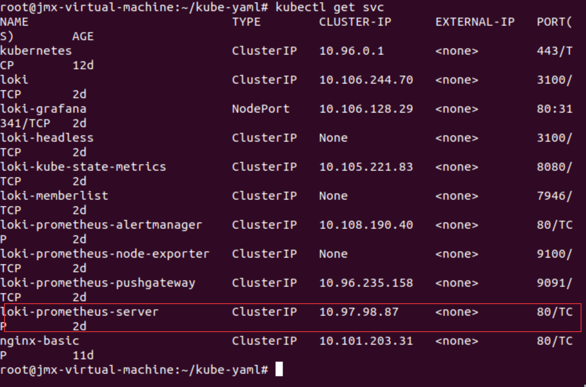

### 安装Loki-Stack
```shell
helm repo add grafana https://grafana.github.io/helm-charts

helm repo update

helm upgrade --install loki grafana/loki-stack --set grafana.enabled=true,prometheus.enabled=true,prometheus.alertmanager.persistentVolume.enabled=false,prometheus.server.persistentVolume.enabled=false
```


### 将grafana service type修改为NodePort
```shell
kubectl edit svc loki-grafana -oyaml -n default
```


### 获取grafana service的用户名密码

将红框所示部分的内容，base64解码即可

### 通过浏览器访问


### Prometheus
### Code
```text
具体Prometheus以及时延代码，见main.go
需要重新打docker image并推送到docker hub
```


```yaml
apiVersion: apps/v1
kind: Deployment
metadata:
  name: httpserver
spec:
  replicas: 1
  selector:
    matchLabels:
      app: httpserver
  template:
    metadata:
      annotations:
        prometheus.io/scrape: "true"
        prometheus.io/port: "80"
      labels:
        app: httpserver
    spec:
      containers:
        - name: httpserver
          imagePullPolicy: Always
          image: pergod/httpserver:v1.1
          ports:
            - containerPort: 80
```


### 获取Metrics数据
```shell
curl 192.168.47.140:80/metrics
```


### 访问相关接口
```shell
curl 192.168.47.140:80/latency
```

### 访问Prometheus&并查看统计结果



### 关联grafana
*注意，作业中定义的指标名为http_request_latency_seconds_bucket*
```json
{
  "annotations": {
    "list": [
      {
        "builtIn": 1,
        "datasource": "-- Grafana --",
        "enable": true,
        "hide": true,
        "iconColor": "rgba(0, 211, 255, 1)",
        "name": "Annotations & Alerts",
        "target": {
          "limit": 100,
          "matchAny": false,
          "tags": [],
          "type": "dashboard"
        },
        "type": "dashboard"
      }
    ]
  },
  "editable": true,
  "gnetId": null,
  "graphTooltip": 0,
  "id": 4,
  "links": [],
  "panels": [
    {
      "datasource": "Prometheus",
      "fieldConfig": {
        "defaults": {
          "color": {
            "mode": "palette-classic"
          },
          "custom": {
            "axisLabel": "",
            "axisPlacement": "auto",
            "barAlignment": 0,
            "drawStyle": "line",
            "fillOpacity": 0,
            "gradientMode": "none",
            "hideFrom": {
              "legend": false,
              "tooltip": false,
              "viz": false
            },
            "lineInterpolation": "linear",
            "lineWidth": 1,
            "pointSize": 5,
            "scaleDistribution": {
              "type": "linear"
            },
            "showPoints": "auto",
            "spanNulls": false,
            "stacking": {
              "group": "A",
              "mode": "none"
            },
            "thresholdsStyle": {
              "mode": "off"
            }
          },
          "mappings": [],
          "thresholds": {
            "mode": "absolute",
            "steps": [
              {
                "color": "green",
                "value": null
              },
              {
                "color": "red",
                "value": 80
              }
            ]
          }
        },
        "overrides": []
      },
      "gridPos": {
        "h": 9,
        "w": 12,
        "x": 0,
        "y": 0
      },
      "id": 2,
      "options": {
        "legend": {
          "calcs": [],
          "displayMode": "list",
          "placement": "bottom"
        },
        "tooltip": {
          "mode": "single"
        }
      },
      "targets": [
        {
          "exemplar": true,
          "expr": "histogram_quantile(0.95, sum(rate(http_request_latency_seconds_bucket[5m])) by (le))",
          "interval": "",
          "legendFormat": "",
          "refId": "A"
        },
        {
          "exemplar": true,
          "expr": "histogram_quantile(0.90, sum(rate(http_request_latency_seconds_bucket[5m])) by (le))",
          "hide": false,
          "interval": "",
          "legendFormat": "",
          "refId": "B"
        },
        {
          "exemplar": true,
          "expr": "histogram_quantile(0.50, sum(rate(http_request_latency_seconds_bucket[5m])) by (le))",
          "hide": false,
          "interval": "",
          "legendFormat": "",
          "refId": "C"
        }
      ],
      "title": "Response Latency by Percentile",
      "type": "timeseries"
    }
  ],
  "refresh": "",
  "schemaVersion": 30,
  "style": "dark",
  "tags": [],
  "templating": {
    "list": []
  },
  "time": {
    "from": "now-1m",
    "to": "now"
  },
  "timepicker": {},
  "timezone": "",
  "title": "Http Server Latency",
  "uid": "mWgwgx5nz",
  "version": 2
}
```

