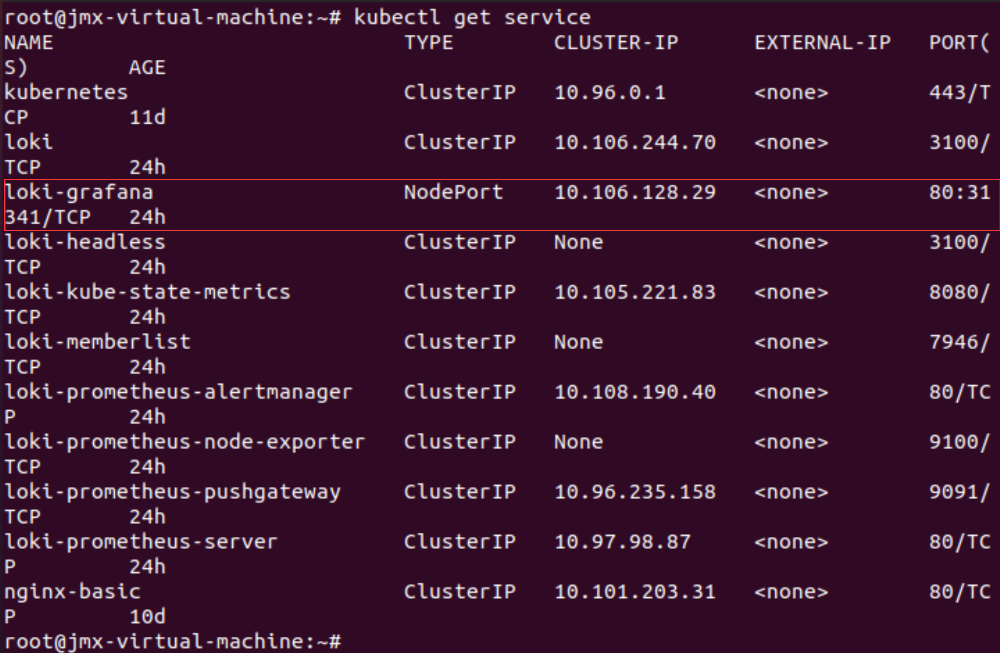

### 安装Loki-Stack
```shell
helm repo add grafana https://grafana.github.io/helm-charts

helm repo update

helm upgrade --install loki grafana/loki-stack --set grafana.enabled=true,prometheus.enabled=true,prometheus.alertmanager.persistentVolume.enabled=false,prometheus.server.persistentVolume.enabled=false
```


### 将grafana service type修改为NodePort
```shell
kubectl edit svc loki-grafana -oyaml -n default
```


### 获取grafana service的用户名密码

将红框所示部分的内容，base64解码即可

### 通过浏览器访问



### Prometheus
```yaml
apiVersion: apps/v1
kind: Deployment
metadata:
  name: httpserver
spec:
  replicas: 1
  selector:
    matchLabels:
      app: httpserver
  template:
    metadata:
      annotations:
        prometheus.io/scrape: "true"
        prometheus.io/port: "80"
      labels:
        app: httpserver
    spec:
      containers:
        - name: httpserver
          imagePullPolicy: Always
          image: pergod/httpserver:v1.1-metrics
          ports:
            - containerPort: 80
```
