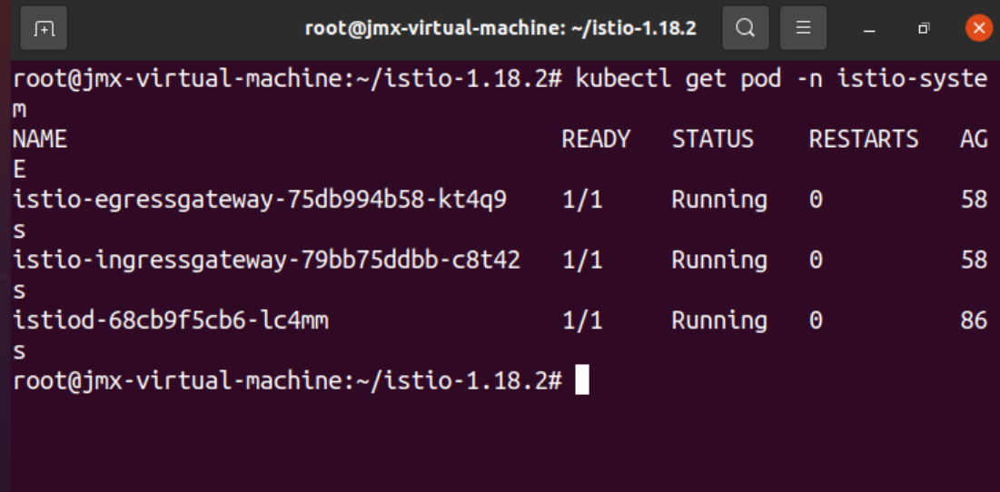
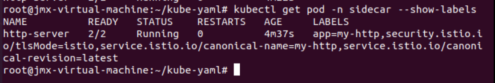
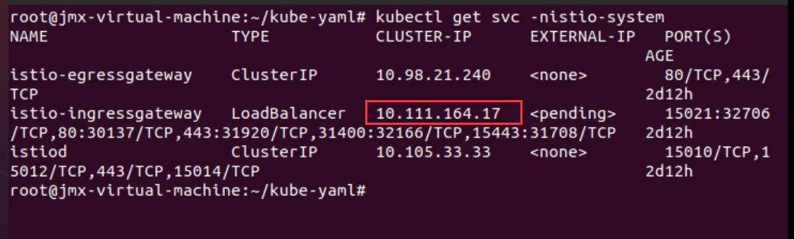
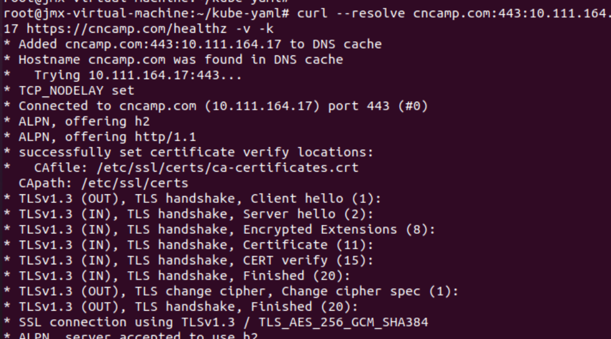
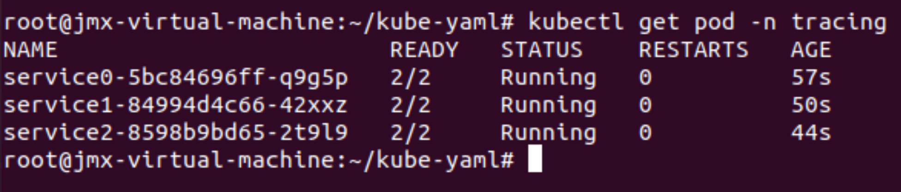
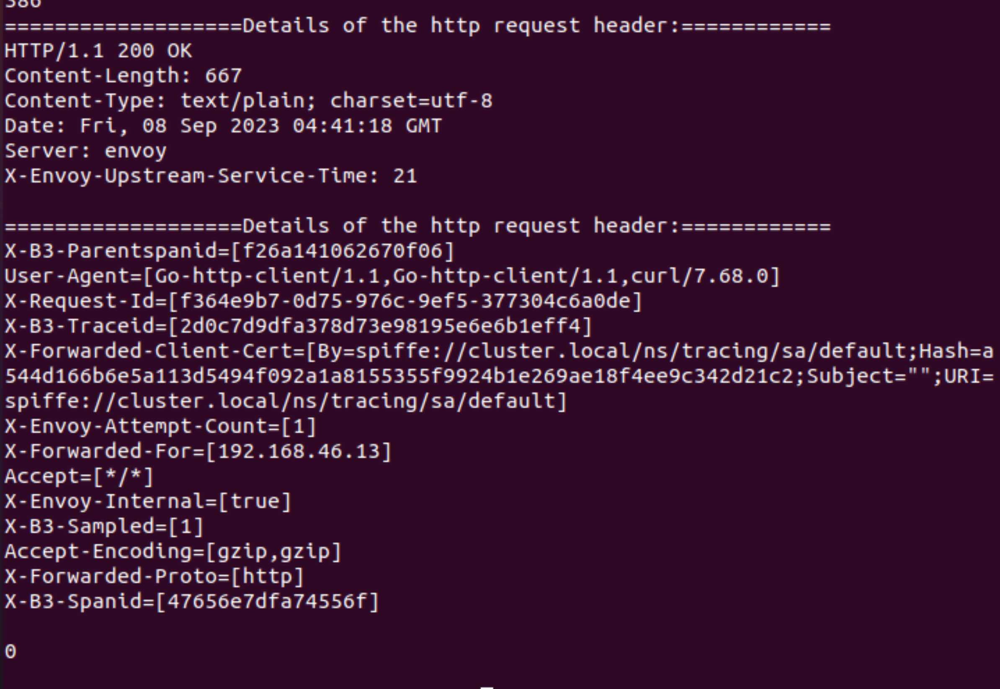
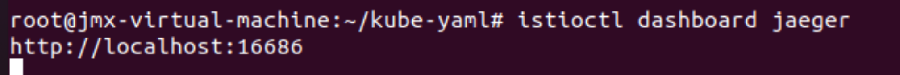
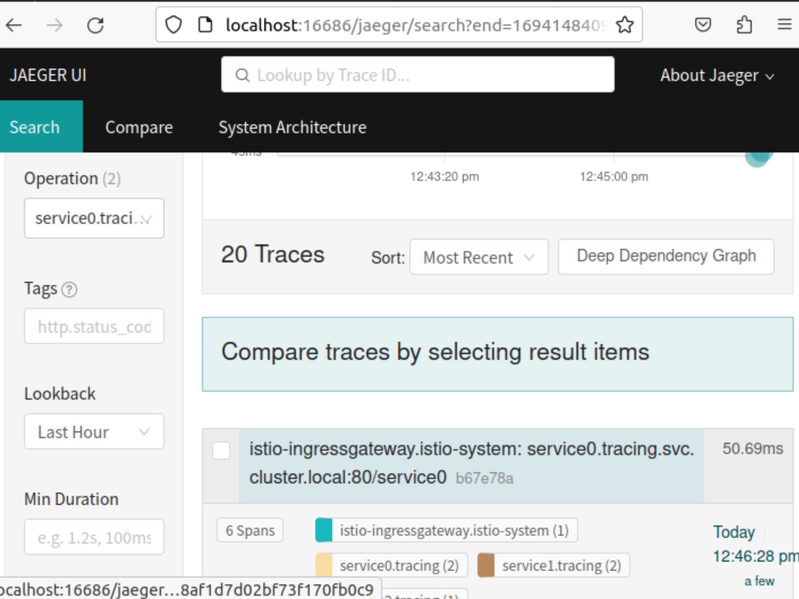

### istio安装
```shell
curl -L https://istio.io/downloadIstio | sh -
cd istio-1.12.0
cp bin/istioctl /usr/local/bin
istioctl install --set profile=demo -y

#如果运行Curl命令提示Connection refused，可以访问https://istio.io/downloadIstio,将对应的Bash文件，拷贝下来执行
#具体内容见istio-install.sh
```
安装完成，kubectl get pod -n istio-system



### 创建namespace
```shell
kubectl create ns sidecar
kubectl label ns sidecar istio-injection=enabled
```

### 创建Deployment，具体文件见httpserver.yaml
```shell
kubectl create -f httpserver.yaml -n sidecar
```



### 发布为ingress gateway(https)，具体文件见istio-specs.yaml
```shell
openssl req -x509 -sha256 -nodes -days 365 -newkey rsa:2048 -subj '/O=cncamp Inc./CN=*.cncamp.io' -keyout cncamp.io.key -out cncamp.io.crt
kubectl create -n istio-system secret tls cncamp-credential --key=cncamp.io.key --cert=cncamp.io.crt
kubectl apply -f istio-specs.yaml -n sidecar
```

```shell
kubectl get svc -nistio-system
```


```shell
export INGRESS_IP=10.111.164.17
curl --resolve cncamp.com:443:$INGRESS_IP https://cncamp.com/healthz -v -k
```
结果如下


---------------------------------------------------------------------------------------------------------------------------

### 安装jaeger，具体文件见jaeger.yaml
```shell
kubectl apply -f jaeger.yaml
```

### 创建namespace，相关yaml文件目录下同名文件
```shell
kubectl create ns tracing
kubectl label ns tracing istio-injection=enabled
kubectl -n tracing create -f service0.yaml
kubectl -n tracing create -f service1.yaml
kubectl -n tracing create -f service2.yaml
kubectl create -f istio-tracing.yaml -n tracing
```


```shell
kubectl get svc -nistio-system
```


```shell
curl 10.111.164.17/service0
```


```shell
istioctl dashboard jaeger
```




