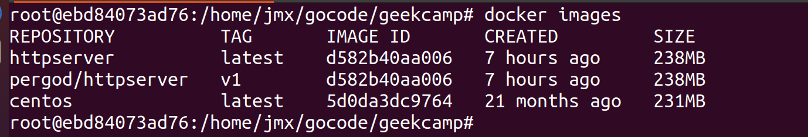
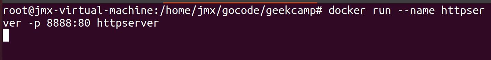
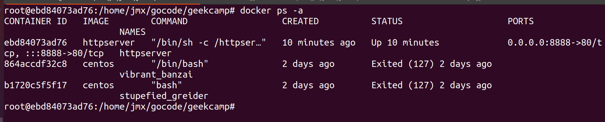
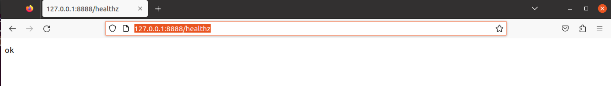
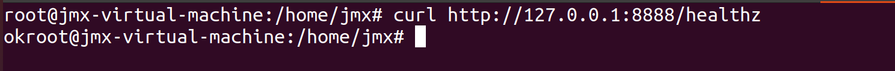
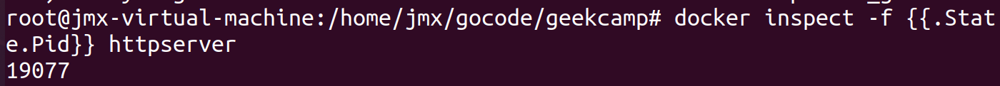
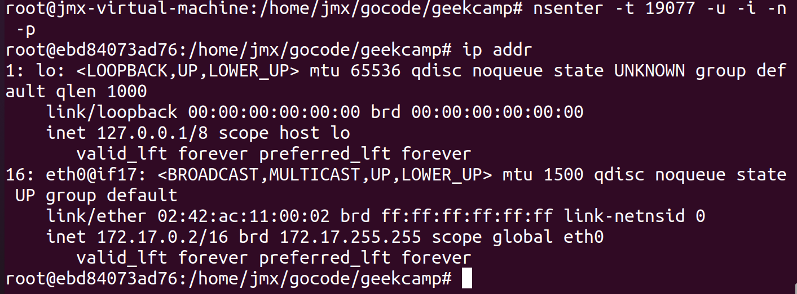
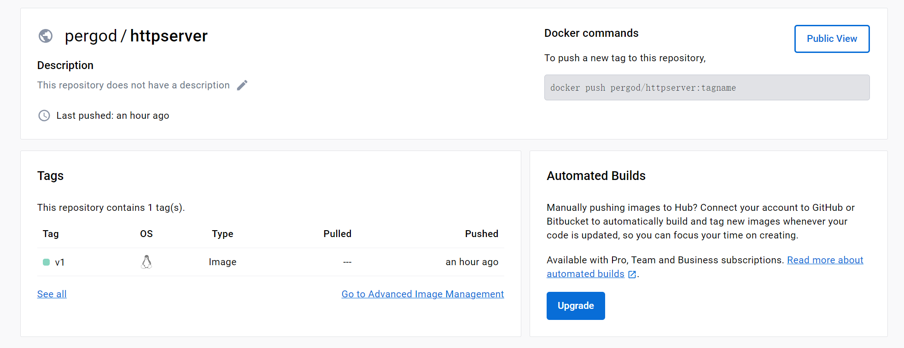

# 模块三作业
1. 代码构建  
当前路径下执行`go build`命令
2. Dockerfile编写，具体内容见Dockerfile
3. 执行构建 
`docker build -t httpserver .`
4. 查看images 
`docker images`

5. 运行容器镜像 
`docker run --name httpserver -p 8888:80 httpserver`

6. 查看进程 
`docker ps -a`查看所有进程

7. 验证功能是否正常 
通过浏览器访问 

或者命令`curl http://127.0.0.1:8888/healthz`

8. 查看容器进程PID 
`docker inspect -f {{.State.Pid}} httpserver`

9. 进入容器 
以下的PID来源于step 8的结果 
`nsenter -t 19077 -u -i -n -p`
10. 查看IP
`ip addr`

11. 推送镜像  
   `docker login`登陆自己的账户  
   `docker tag httpserver pergod/httpserver:v1`打tag  
   `docker push pergod/httpserver:v1`推送到远程仓库  
   我的镜像：https://hub.docker.com/repository/docker/pergod/httpserver/general
