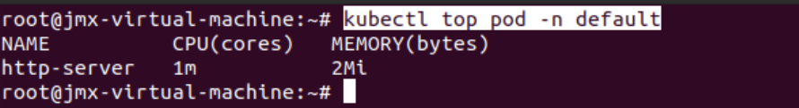
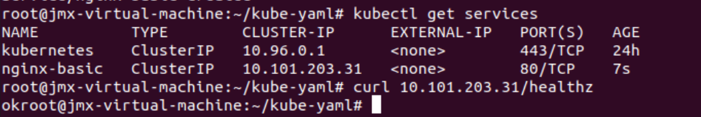

#### 作业1
### 优雅启停
```yaml
apiVersion: v1
kind: Pod
metadata:
  name: http-server
spec:
  containers:
    - name: http-server
      image: pergod/httpserver:v1
      # Readiness探针：检查容器是否已准备好接收流量
      readinessProbe:
        httpGet:
          path: /healthz
          port: 80
        initialDelaySeconds: 30
        periodSeconds: 5
        successThreshold: 2
      # 命令探活： 在容器中执行指定的命令，并检查其退出状态码来判断容器的健康状态
      livenessProbe:
        exec:
          command:
            - cat
            - /tmp/health
        initialDelaySeconds: 15
        periodSeconds: 30
      # 容器停止的等待时间，Kubernetes 会在发送 SIGTERM 信号给容器后等待一段时间，
      # 以便容器能够处理完正在运行的请求。
      # 如果在等待时间内容器仍未停止，Kubernetes 会发送 SIGKILL 信号来强制终止容器。
      terminationGracePeriodSeconds: 30

```

### 安装metrics
```shell
kubectl apply -f https://raw.githubusercontent.com/pythianarora/total-practice/master/sample-kubernetes-code/metrics-server.yaml
```
### 查看pod资源占用
```shell
kubectl top pod -n default
```


### 设置资源&QoS

```yaml
resources:
  requests:
    cpu: "10m"
    memory: "25Mi"
qosClass: Burstable 
```

### Install kubeadm

```shell
$ sudo curl -s https://mirrors.aliyun.com/kubernetes/apt/doc/apt-key.gpg | sudo apt-key add -
```

#### 作业2 - Service
### 设置label
```yaml
metadata:
name: http-server
labels:
app: my-http
```
### 创建service
```yaml
apiVersion: v1
kind: Service
metadata:
  name: nginx-basic
spec:
  type: ClusterIP
  ports:
    - port: 80
      protocol: TCP
      name: http
  selector:
    app: my-http
```
### 测试
```shell
curl 10.101.203.31/healthz
```


#### 作业2 - Ingress 
